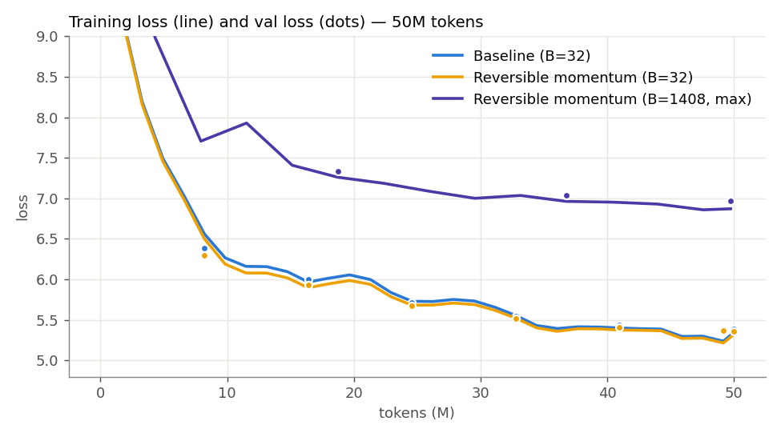
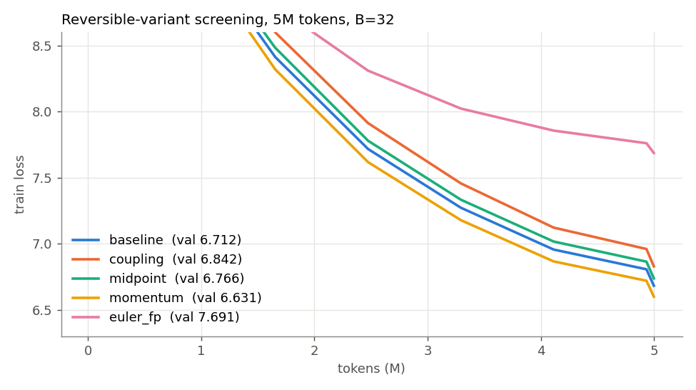
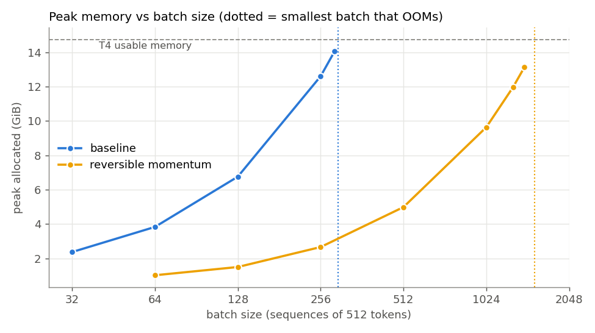
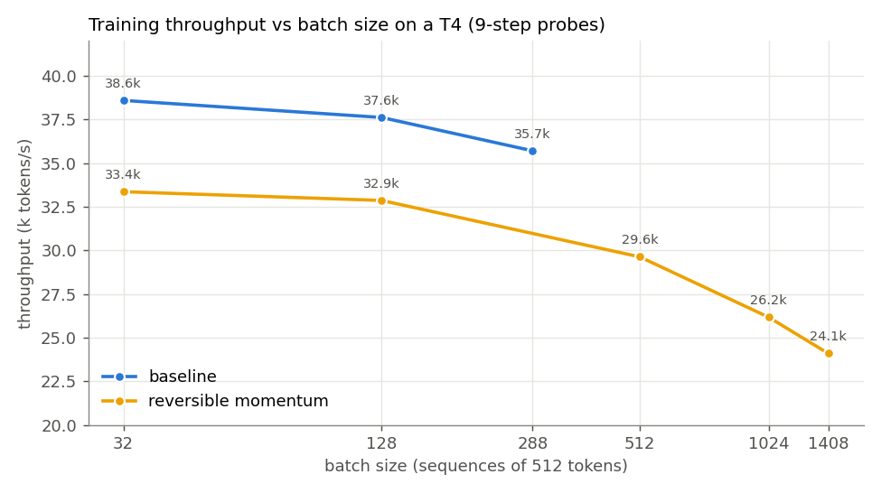

# Assignment 13: Reversible Training of a 20M-Parameter LLM

We train a 20.9M-parameter GPT on 50M FineWeb tokens on a Google Colab T4, three times:

1. **Baseline** at a fixed batch size (B = 32 × 512 tokens).
2. **Reversible** model at the same batch. We tried four reversible schemes (Euler, coupling, midpoint/leapfrog, momentum) and kept the one that trained best, which was **momentum**.
3. The same reversible model pushed to the **largest batch that fits on the GPU** (B = 1408).

All training ran on Colab (driven from Chrome). The executed notebooks, with their outputs, are in this folder.

| Notebook | What it does |
|---|---|
| [`01_baseline.ipynb`](01_baseline.ipynb) | Baseline 50M-token run at B=32, then a max-batch probe for the baseline |
| [`02_reversible_variants.ipynb`](02_reversible_variants.ipynb) | Gradient checks, reconstruction errors, 5M-token screening of the 4 reversible variants, then the full 50M-token run with the winner at B=32 |
| [`03_reversible_max_batch.ipynb`](03_reversible_max_batch.ipynb) | Max-batch search for the reversible model, 50M-token run at that batch, throughput-vs-batch diagnostic |
| [`04_results.ipynb`](04_results.ipynb) | Runs locally. Parses the three notebooks' outputs and makes the table and plots below |
| [`revgpt.py`](revgpt.py) | Model, reversible autograd function, training loop, memory probe. Each Colab notebook writes a copy of it with `%%writefile` |

---

## Headline results (50M tokens each, Tesla T4, fp16)

| Run | Batch (tokens/step) | Optimizer steps | Final train loss (EMA) | **Final val loss** | **Speed (tok/s)** | **Peak memory** | Wall time |
|---|---|---|---|---|---|---|---|
| Baseline | 32 (16,384) | 3,051 | 5.251 | **5.385** | **35,307** | **2.37 GiB** | 23.6 min |
| Reversible (momentum) | 32 (16,384) | 3,051 | 5.231 | **5.360** | **32,195** (−8.8 %) | **0.96 GiB** (−59 %) | 25.8 min |
| Reversible (momentum), max batch | **1408** (720,896) | 69 | 6.920 | **6.966** | **24,084** (−32 %) | **13.12 GiB** | 31.9 min |

| Memory capacity | Baseline | Reversible (momentum) | Ratio |
|---|---|---|---|
| Activation memory per training token | 93.5 KiB | 18.6 KiB | **5.0× less** |
| Largest batch that fits in the T4's 15 GB | 288 | **1408** | **4.9× larger** |

**In short:** reversibility worked. At the same batch, the momentum-reversible model matched the baseline's loss (5.360 vs 5.385; with one seed that gap is too small to call better). It used 2.5× less peak memory and ran 8.8 % slower. It needs 5× less activation memory per token, so the batch can grow 4.9×. But spending that headroom on a bigger batch was the wrong choice here. With the token budget fixed at 50M, B=1408 leaves only 69 optimizer steps, and val loss finished at 6.97 instead of 5.36. On top of that, per-token throughput *drops* at large batch on a T4.

---

## Setup (identical for every run)

| | |
|---|---|
| Model | GPT, 10 layers, d_model 256, 8 heads (head dim 32), GELU MLP 4×, pre-LayerNorm, **20.88M parameters**. The tied GPT-2 embedding / LM head is 12.9M of that |
| Context | T = 512 |
| Data | First **50,000,000** GPT-2 tokens of FineWeb (`kjj0/fineweb10B-gpt2`, train shard 1), read sequentially: one epoch, no repeats. Val = first 2M tokens of the FineWeb val shard; evaluation uses 20 batches of it |
| Optimizer | AdamW β=(0.9, 0.95), wd 0.1, grad-clip 1.0, lr 1e-3, 3 % linear warm-up, then cosine decay to 10 % |
| Precision | fp16 autocast + GradScaler. The residual streams stay fp32 |
| Hardware | Google Colab free tier, **Tesla T4 (15 GB)**, PyTorch 2.11 + CUDA 12.8, no `torch.compile` |
| Loss | Cross-entropy computed in 1024-token chunks, each chunk checkpointed. Without this, the 50k-vocab logits (B·T·V in fp32) are the largest tensor in the step and would hide any saving in the transformer blocks. **Every run uses it.** |

"Speed" is tokens/s over pure training-step time: forward + backward + optimizer, starting after 5 warm-up steps, with evaluation excluded. "Peak memory" is `torch.cuda.max_memory_allocated()` over the whole run.

---

## Reversible variants

A residual network is a discretized ODE: $x_{k+1} = x_k + F_k(x_k)$ is one **explicit Euler** step. To drop the stored activations, the backward pass has to recover $x_k$ from $x_{k+1}$. For the plain Euler step that means solving $x = y - F(x)$, which has no closed form. The other three schemes below are built so that each step can be inverted exactly. **All four use exactly the same parameters** (10 attention sub-layers + 10 MLP sub-layers). Only the wiring into the residual stream changes.

| Variant | Update rule (F = one pre-LN Attn or MLP sub-layer) | Inverse | Exact? |
|---|---|---|---|
| **euler_fp** (plain residual) | $x' = x + F(x)$ | fixed-point iteration $x \leftarrow x' - F(x)$, K = 3 | only if $F$ is a contraction |
| **coupling** (RevNet / Reformer; symplectic Euler on two streams) | $y_1 = x_1 + \text{Attn}(x_2)$, $y_2 = x_2 + \text{MLP}(y_1)$ | $x_2 = y_2 - \text{MLP}(y_1)$, then $x_1 = y_1 - \text{Attn}(x_2)$ | yes |
| **midpoint** (leapfrog / explicit midpoint, Chang et al. 2018) | $x_{k+1} = x_{k-1} + F_k(x_k)$ | $x_{k-1} = x_{k+1} - F_k(x_k)$ | yes |
| **momentum** (Momentum ResNet, Sander et al. 2021), γ = 0.9 | $v' = \gamma v + (1-\gamma)F(x)$, $x' = x + v'$ | $x = x' - v'$, $v = (v' - (1-\gamma)F(x))/\gamma$ | yes, but rounding error grows by 1/γ per step |

**Implementation** ([`revgpt.py`](revgpt.py)). One `torch.autograd.Function` wraps the whole 10-layer stack:

* **Forward** runs under `no_grad` and saves only the final stream state (two B×T×256 fp32 tensors).
* **Backward** walks the steps in reverse. For each step it rebuilds the input from the output, re-runs that one sub-layer with autograd on, and back-propagates through it. Parameter gradients accumulate straight into `.grad`.
* **One forward per step:** rebuilding the input and the recompute share a single forward (the RevNet trick). So each step costs about one extra sub-layer forward compared with the baseline.
* **Autocast consistency:** `custom_fwd`/`custom_bwd` keep autocast identical between the forward pass and the recompute, so the recomputed $F(x)$ is bit-identical to the one used in the forward.

### Correctness checks (notebook 2, section 1)

| | coupling | midpoint | momentum | euler_fp K=1 | K=3 | K=10 | K=30 |
|---|---|---|---|---|---|---|---|
| Gradient rel. error vs. plain autograd (tiny model, float64) | 2.3e-16 | 2.6e-16 | 2.3e-16 | 0.23 | 0.037 | 9.5e-5 | 1.9e-10 |
| Input reconstruction rel. error (full model, fp32, init weights) | 2.0e-6 | 2.1e-6 | 5.0e-6 | – | **1.22** | – | **0.59** |

The three exact schemes reproduce autograd's gradients to machine precision. Euler with fixed-point inversion converges on a tiny model, but **on the real 256-wide model it does not converge at all**: the error is still 59 % after 30 iterations. Pre-LayerNorm makes $F$ scale-invariant in its input, so while the residual stream is small (std ≈ 0.02 at init) its Lipschitz constant is ≫ 1, and the fixed-point map is not a contraction.

### Variant screening (5M tokens, B=32, same seed and data)

| Variant | Val loss @ 5M | Speed (tok/s) | Peak memory |
|---|---|---|---|
| baseline | 6.712 | 38,338 | 2.37 GiB |
| **momentum** | **6.631** | 32,141 | 0.96 GiB |
| midpoint | 6.766 | 33,854 | 0.96 GiB |
| coupling | 6.842 | 34,384 | 0.98 GiB |
| euler_fp (K=3) | 7.691 | 27,901 | 0.95 GiB |

**Which variant worked:**

* **Momentum** worked best. It was the only one to beat the baseline at 5M tokens, and it held level with the baseline over the full 50M (5.360 vs 5.385).
* **Midpoint (leapfrog)** also worked well, only slightly behind the baseline.
* **Coupling (RevNet)** is exact and fastest of the reversible schemes, but learned the slowest of the exact ones. Each stream only receives half of the sub-layers' updates, and both streams start as the same embedding.
* **Euler with fixed-point inversion did not work.** Its gradients are wrong because the inverse never converges, so training stalls near loss 7.7. It is also the slowest, because every step costs K + 1 extra forwards.

---

## Findings

**1. Same batch: reversibility costs about 9 % speed and saves 59 % of peak memory, with no loss penalty.**
The momentum model reached val 5.360 vs the baseline's 5.385. That is a single seed and the gap is small, so the fair reading is "no worse", not "better". Peak memory fell from 2.37 to 0.96 GiB. The saving is "only" 2.5× at B=32 because roughly 0.5 GiB (weights, fp32 Adam state, one checkpointed CE chunk) does not depend on the batch.

**2. The recompute is cheaper than the textbook +33 %.**
Throughput fell only 8.8 % (35.3k → 32.2k tok/s). One extra forward through every block adds 33 % to the *blocks'* compute (3 passes become 4), but the blocks are a minority of the step. With a 50k vocabulary at d=256, the tied LM head (12.9M params) is larger than all 10 transformer blocks combined (7.9M), and the checkpointed CE runs the head forward twice. Per token, the blocks are about 7.9M × 3 passes against 12.9M × 4 for the head, which is roughly 31 % of the matmul FLOPs. 33 % × 31 % ≈ +10 % predicted, close to the 8.8 % measured.

**3. Activation memory per token drops 5×, so the max batch grows 4.9×.**
From the batch probes: baseline activations cost 93.5 KiB per token (4.7 KiB per sub-layer × 20). The reversible model costs 18.6 KiB per token, independent of depth. Of that 18.6 KiB, the fp32 x and v streams plus their gradients are 4 KiB. The rest is one sub-layer's recompute workspace and the embedding / final-LN / CE tensors. The largest batch that fits went from 288 to 1408.

**4. Pushing to the maximum batch hurt: val loss 6.97 vs 5.36.**
The token budget is fixed at 50M, so B=1408 (720,896 tokens/step) leaves only **69 optimizer steps**, against 3,051 at B=32. Even with the learning rate raised to 3e-3 (√B scaling, capped) and 10 % warm-up, 69 steps is far too few. The final loss (≈ 6.9) is where the B=32 runs were after only about 150 steps, or 2.5M tokens. A 20M model on 50M tokens has a critical batch size far below 720k tokens. Past that point, a larger batch just spends the same tokens on fewer, barely better updates.

**5. The max batch was also slower per token.**
Throughput vs batch (a 9-step probe for each point, last cell of notebook 3):

| Batch | 32 | 128 | 288 | 512 | 1024 | 1408 |
|---|---|---|---|---|---|---|
| Baseline tok/s | 38.6k | 37.6k | 35.7k | – | – | – |
| Momentum tok/s | 33.4k | 32.9k | – | 29.6k | 26.2k | 24.1k |

Both models slow down steadily as the batch grows; there is no sudden drop near the memory limit. Allocator thrash is ruled out: `num_alloc_retries` went up by only 2 over the whole B=1408 probe. Beyond that, this data does not identify the cause. A T4 is already saturated at B=32 × 512, so a bigger batch cannot buy more throughput, only memory headroom. Put together, the max-batch run on a T4 was worse on loss *and* slower than B=32.

**6. Where reversibility actually pays off.**
The memory saving is real (5× per token and O(1) in depth), but at this model size a larger batch is the wrong thing to spend it on. It is worth more for:

* a deeper or wider model (reversible activation memory does not grow with depth),
* longer context,
* the same model on a smaller GPU.

---

## Practical gotchas hit along the way

* **bf16 on a T4.** `torch.cuda.is_bf16_supported()` returns `True` on a T4 (sm75), but bf16 is only emulated there. `scaled_dot_product_attention` then falls back to the O(T²) math kernel: the first attempt ran slowly and used 6.7 GiB at B=32. `amp_dtype()` now picks bf16 only on sm80+, and fp16 + GradScaler otherwise. That brought the baseline to 2.37 GiB.
* **Logits dominate memory for small-d, large-vocab models.** In a smoke test with 4096-token CE chunks, about 2.5 GiB of the reversible model's peak was logit tensors (4096 × 50304 × fp16/fp32 + grad). Reducing the chunk to 1024 tokens fixed this for every run.
* **Reconstruction precision.** Keeping the residual streams in fp32 while the sub-layers run in fp16 keeps reconstruction error around 1e-6. Momentum's 1/γ amplification over 20 steps (1/0.9^20 ≈ 8×) is still harmless at that level.

---

## Reproducing

Each Colab notebook is self-contained: its first cell writes `revgpt.py`, and the data (about 400 MB of pre-tokenized shards) downloads from the Hugging Face Hub. Run 01 → 02 → 03 on a T4 runtime, which takes about 30–45 min each. Then run `04_results.ipynb` locally, next to the executed notebooks, to regenerate the plots.
