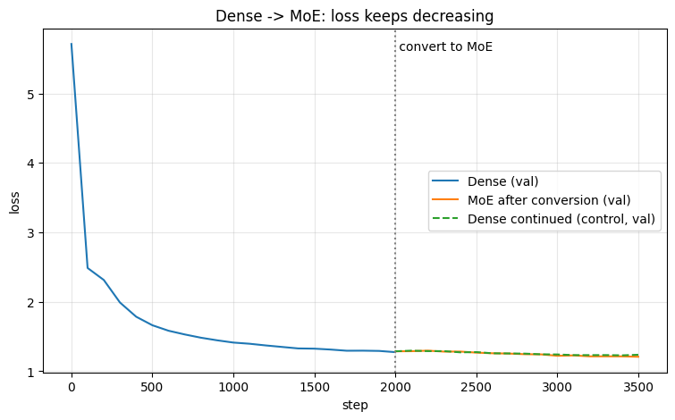

# Assignment 14: Dense GPT -> Mixture-of-Experts (sparse upcycling)

Trained on a Colab T4 (driven through Claude in Chrome). Executed notebook: [moe_upcycling_executed.ipynb](moe_upcycling_executed.ipynb). Numbers: [results.json](results.json).

## Setup
- **Data:** 120M bytes of WikiText-103 (byte-level, vocab 256), 99/1 train/val split. Each step uses 64x256 = 16k tokens and batches are random crops, so every model trains on **well under one epoch** (dense phase 33M tokens, 57M tokens by the end of the MoE/control phase vs 119M available). Nothing is repeated, so there is no memorisation: val loss tracks train loss.
- **Model:** 6-layer GPT, d=384, 6 heads, ctx 256, **10.9M params**, plain `nn.Linear` MLPs. AdamW, cosine LR, fp16 autocast + GradScaler.
- **Phase 1 (dense):** 2000 steps, lr 1e-3.
- **Conversion:** each block's MLP becomes an MoE layer with 8 experts, top-2 routing. Every expert is a copy of the trained dense MLP (+1% noise); the router is a fresh small-random `Linear(384, 8)`. Result: **60.6M total params, 18.1M active per token**. Switch-style load-balancing loss (weight 0.01).
- **Phase 2:** 1500 more steps at lr 3e-4 for the MoE. A **dense control** copy gets the same 1500 steps and schedule.

## Results (val loss, 100-step eval interval)
| | step | val loss |
|---|---|---|
| Dense, start | 0 | 5.711 |
| Dense, end of phase 1 | 2000 | 1.275 |
| **MoE right after conversion** | 2000 | **1.282** |
| MoE, end | 3500 | **1.208** |
| Dense control, end | 3500 | 1.237 |

Train loss at the start of phase 2 (step 2001): MoE 1.261, control 1.265. At the end: MoE 1.184, control 1.213.

- The conversion barely changes the loss (val 1.275 -> 1.282; the small bump is the fresh router and expert noise).
- After conversion the MoE **keeps training: val 1.287 -> 1.208 and train 1.261 -> 1.184**, and it ends ahead of the dense control by 0.03 on val (1.208 vs 1.237) for the same number of steps.
- The gap is modest and comes from a single seed, so treat it as indicative, not conclusive. The MoE does pay for it: it is about 1 s/step on the T4 vs about 0.4 s/step for the control (Python loop over 8 experts, no fused kernels).

## Notes on this run
- An earlier run on Tiny Shakespeare (1M chars) overfit badly after ~1000 steps, so val loss rose while train loss fell. It was replaced by this run on a much larger dataset, with every model kept under one epoch.
- Speed: bf16 autocast is emulated on T4 and slow; switching to fp16 + GradScaler made the dense phase roughly 3x faster. Local (Apple M1, MPS) was far slower than the T4 and was not used.
- Logging gap: the Colab runtime disconnected after the run finished, which dropped `results.json` from the VM and reset part of the notebook's printed output. The notebook therefore only shows dense log lines for steps 0-500 and has no output for the conversion cell. The plot and the MoE/control logs are complete, and the dense end value (1.275) and post-conversion value (1.282) come from the notebook's final summary line. Dense train loss at step 2000 and the parameter counts were not captured in the output; the counts above were recomputed locally from the same model code.
